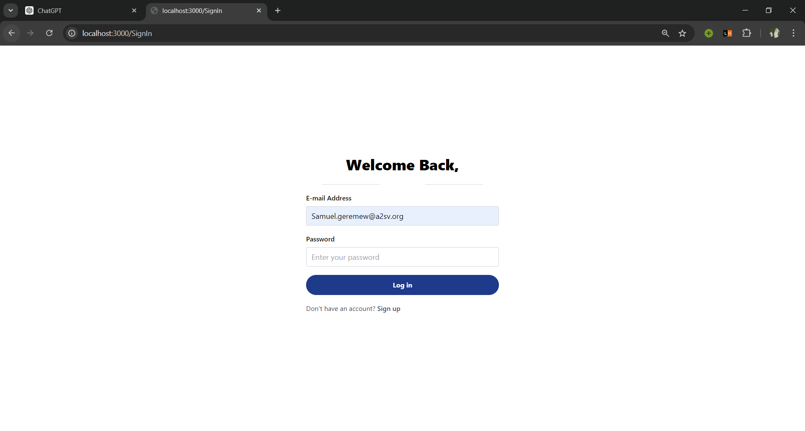
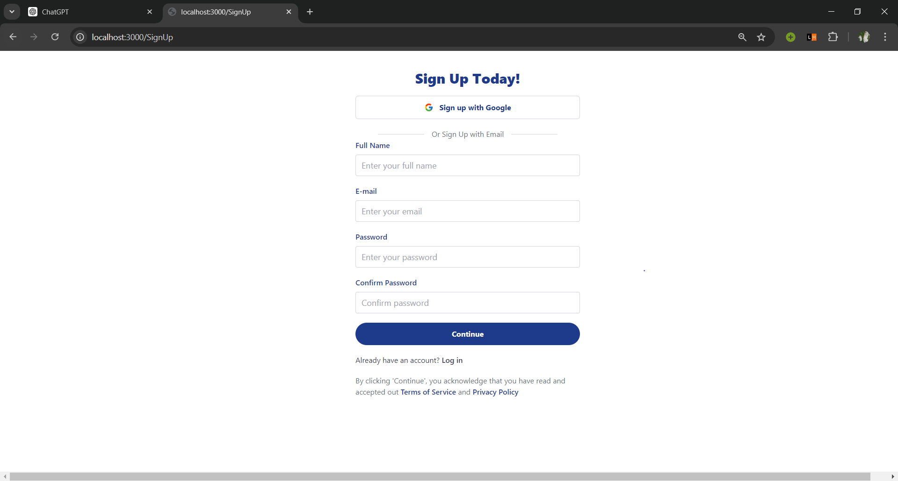

# Next Auth

- This is the 8th task for the web track, which is to integrate Next-auth for authenticating users to the job listing that are in previous tasks. 

## features

- Sign up
- Login
- Client side form validation
- Server side validation

## tech stack

- Nextjs
- Typescript
- Tawilwind css

## Installation

1. **Clone the Repository**

   ```bash
   https://github.com/Samuel-K95/Web-track.git
   ```

2. **Navigate to the Project Directory**

   ```bash
   cd auth-next-ts
   ```

3. **Install necessary modules**

   ```bash
   npm install
   npm run dev
   ```

   Open http://localhost:3000/ and start viewng the pages

## Screenshots






## Demo


https://github.com/user-attachments/assets/2dd0eabc-c914-4f84-8342-dadd460dbc95


https://github.com/user-attachments/assets/422489b8-d7df-4c05-a3e7-b03c96ac64bb

