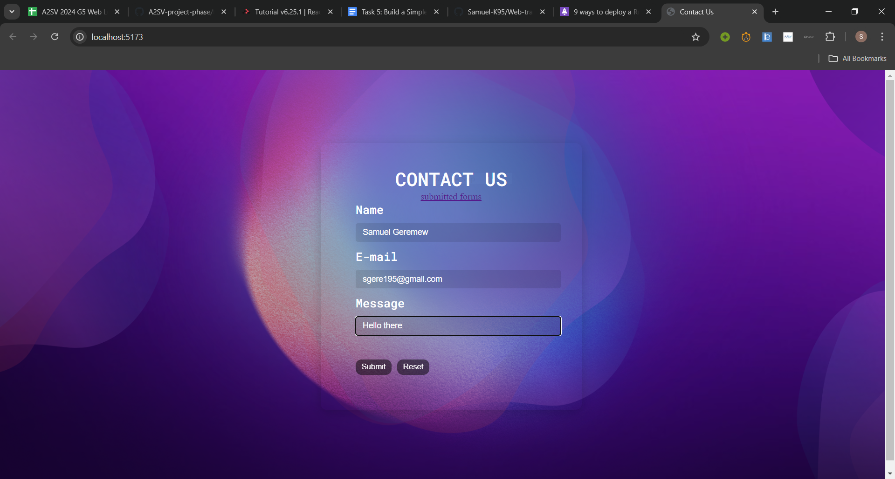
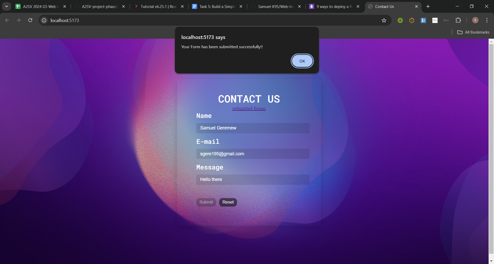
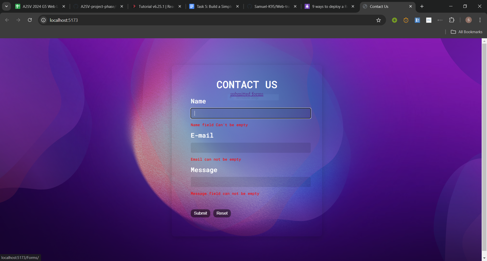
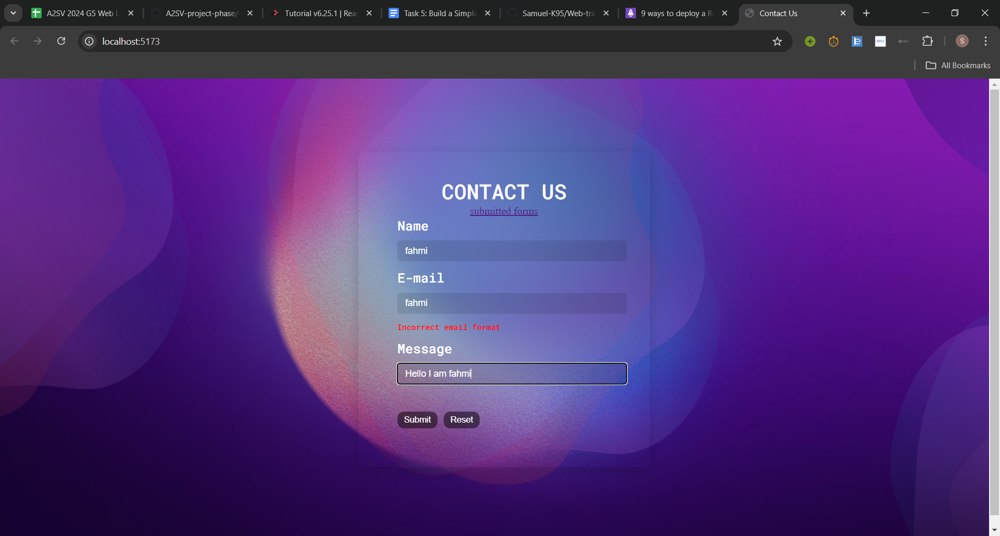
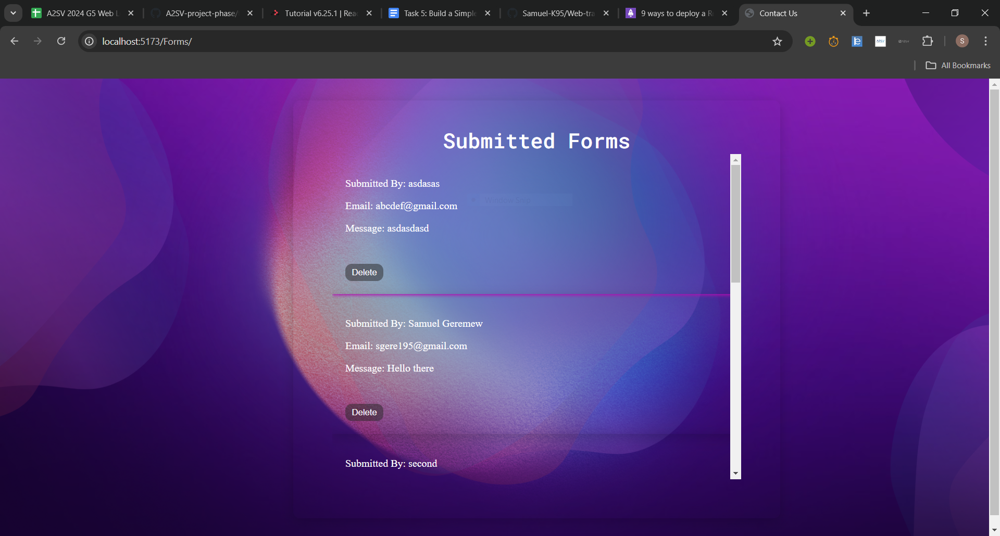
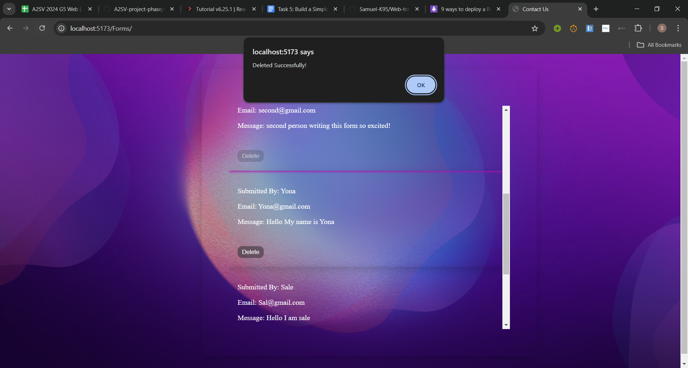

# Contact-Us Form

This is the 5th task of the Web-larning path. it task includes building a simple Contact-us Form using Reach-hook-form.

## Features

- Form Validation (required field and pattern validation)
- Display error messages
- submitting a form
- notification upon submitting a form

## additional features

- included routes to navigate to a second page to view submtted forms
- added deleting form feature along with deletion notification

## Instructions for Running

1. **Clone the Repository**

   ```bash
   https://github.com/Samuel-K95/Web-track.git
   ```

2. **Navigate to the Project Directory**

   ```bash
   cd contact-form-ts-react
   ```

3. **Install necessary modules**

   ```bash
   npm install
   npm run dev
   ```

## Screenshots

1. **Submitting forms**
   
   

2. **Validating forms**
   this image shows form validation of required fields
   

   this image shows email validation using regex
   

3. **Viewing submitted forms**
   by clicing the "submitted forms" below the Contact US, we can navigate to the submitted forms page
   

4. **Deleting a form**
   
