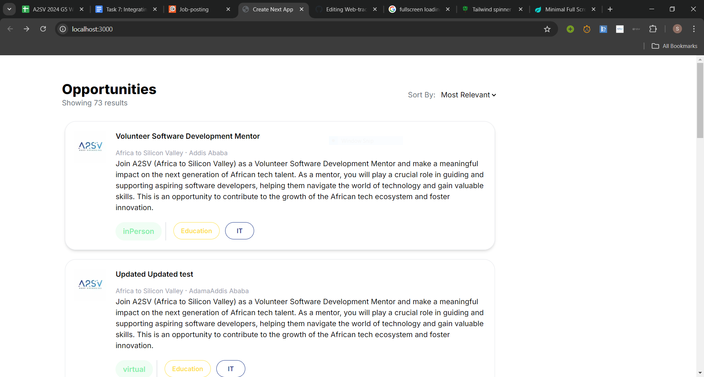
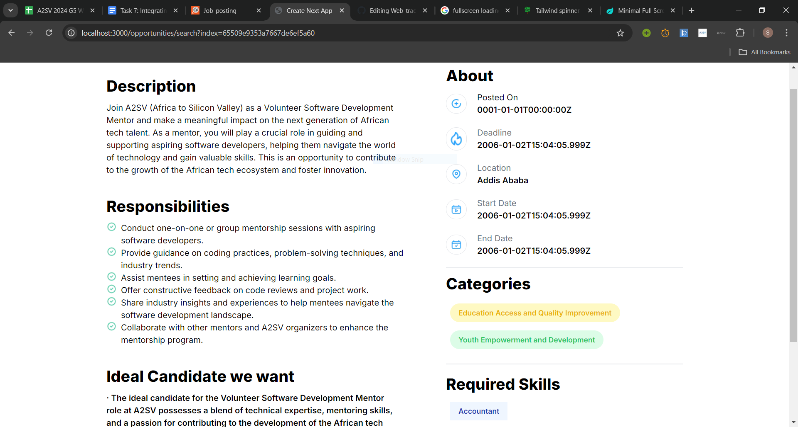
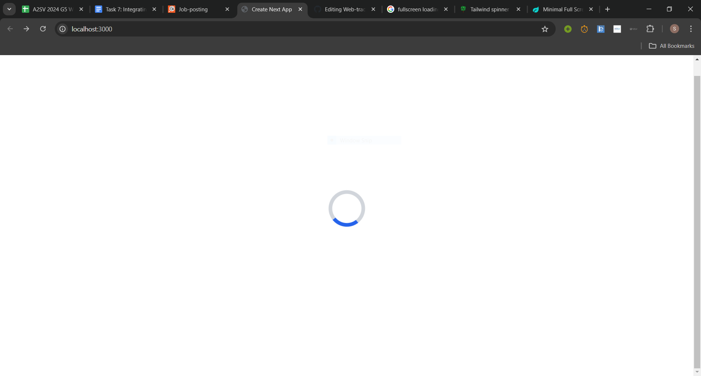

# Job-Listing

This is the 6th task of the Web-larning path. It includes building a Job Listing Page along with a page for the description of each job.

## Features

- Listing Jobs
- Routing to Specific Job description

## Tech Stack

- Next-js
- Tailwindcss
- RTK Query

## Instructions for Running

1. **Clone the Repository**

   ```bash
   https://github.com/Samuel-K95/Web-track.git
   ```

2. **Navigate to the Project Directory**

   ```bash
   cd job-listing-with-api
   ```

3. **Install necessary modules**

   ```bash
   npm install
   npm run dev
   ```

   Open http://localhost:3000/ and start viewng the pages

## Screenshots






https://github.com/user-attachments/assets/8e36ca32-9db6-49b4-8ae5-ee1a42325196

