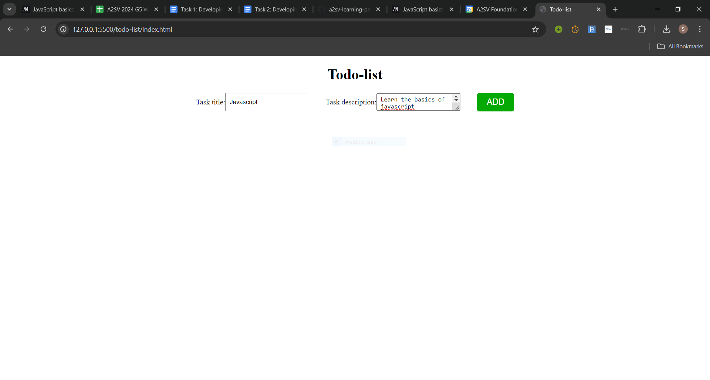
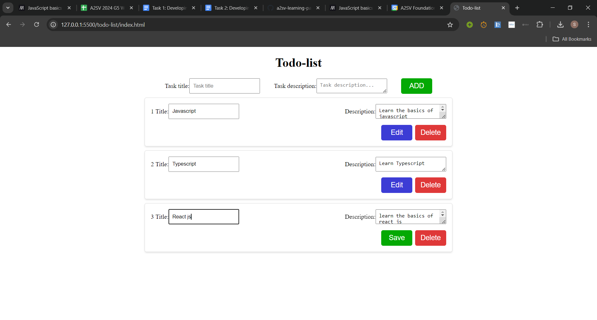

# To-Do List

A simple To-Do List application built using javascript that allows users to add, edit, and delete tasks. The application features a user-friendly interface for managing tasks efficiently.

## Features

- **Add Tasks**: Create new tasks with a title and description.
- **Edit Tasks**: Modify existing tasks by editing the title and description of the task.
- **Delete Tasks**: Remove tasks from the list.

## Instructions for Running

1. **Clone the Repository**

   ```bash
   https://github.com/Samuel-K95/Web-track.git
   ```

2. **Navigate to the Project Directory**

   ```bash
   cd todo-list
   ```

3. **Open the Application**

   Open `index.html` in your preferred web browser.

4. **Screenshots**

# adding task



# editing task


# deleting task


No additional setup is required. Simply open the HTML file to start using the To-Do List application.
